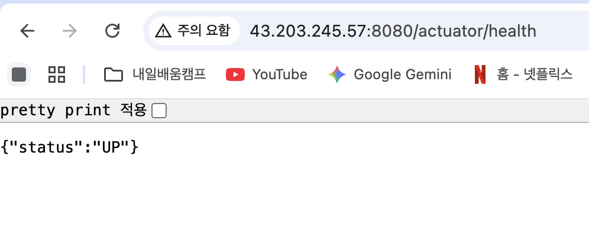
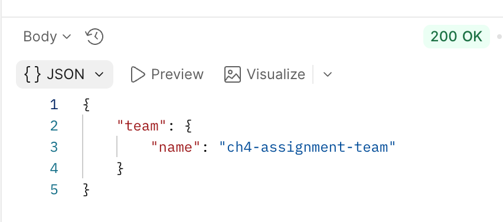
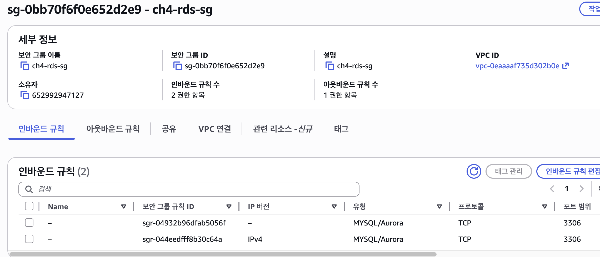
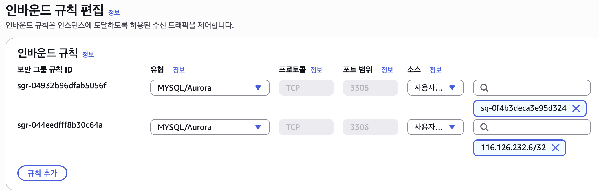

# CH4 과제

## LV 0 - 요금 폭탄 방지 AWS Budget 설정

## LV 1 - 네트워크 구축 및 핵심 기능 배포

EC2 퍼블릭 IP: 43.203.245.57

## LV 2 - DB 분리 및 보안 연결하기

### Actuator Info 엔드포인트 URL

http://43.203.245.57:8080/actuator/info

### RDS 보안 그룹 스크린샷

